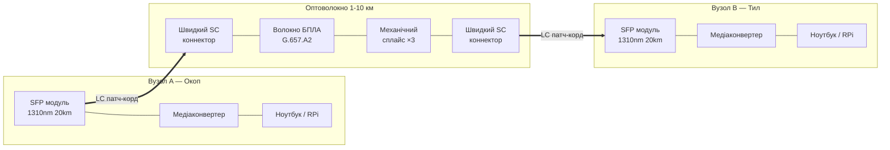
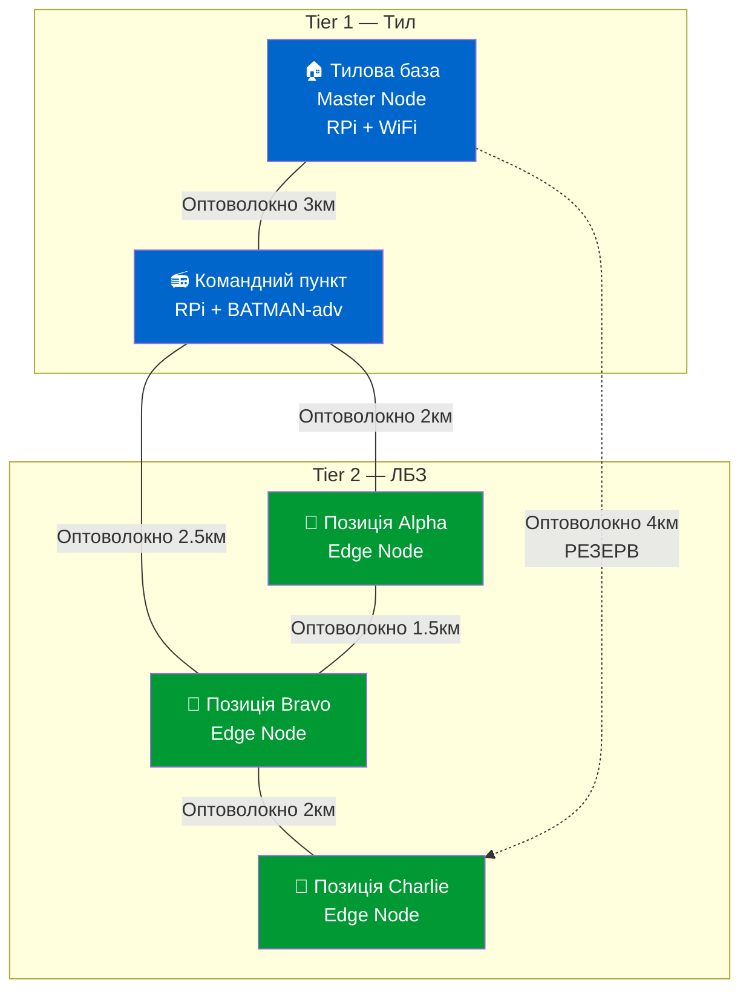
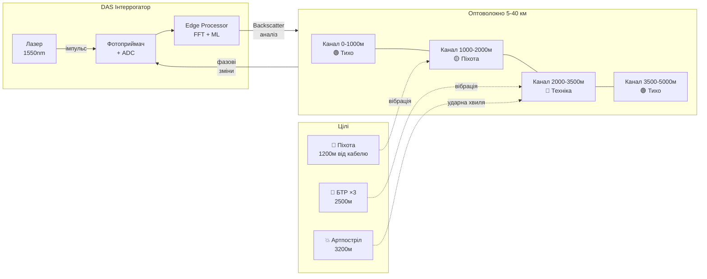
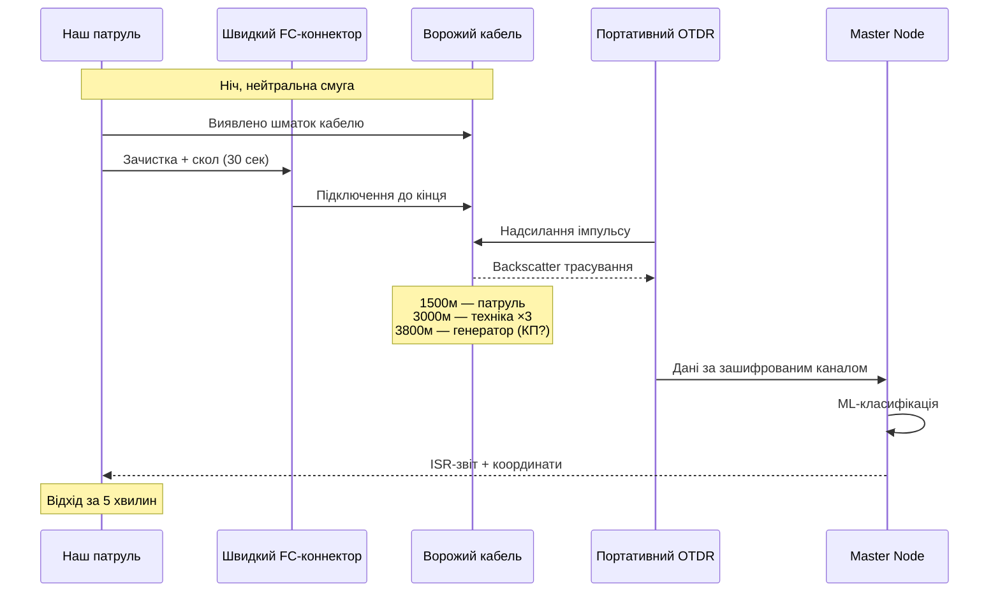
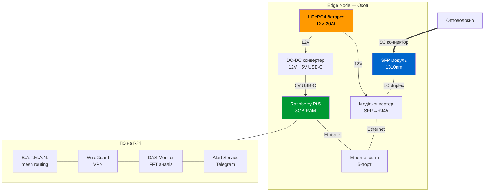
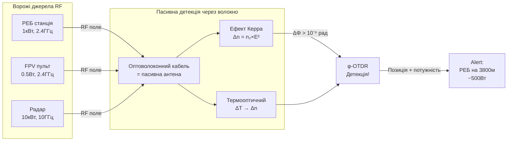
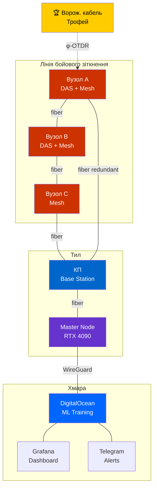

# TFN — Схеми підключення (Connection Diagrams)

## 1. Мінімальна лінія (2 вузли)

### З'єднання
1. Ноутбук → Ethernet → Медіаконвертер → SFP → [SC коннектор] → **Волокно** → [SC коннектор] → SFP → Медіаконвертер → Ethernet → Ноутбук

---

## 2. Mesh-мережа (5 вузлів)

### Маршрутизація
- Протокол: B.A.T.M.A.N. advanced (в ядрі Linux)
- Автоматичне перемикання при обриві: < 5 сек
- Резервування: мінімум 2 шляхи до кожного вузла

---

## 3. DAS-сенсор (φ-OTDR)

---

## 4. Трофейна розвідка

---

## 5. Edge Node — внутрішня схема

---

## 6. RF-Opto детекція

---

## 7. Повна архітектура системи

---

*Схеми підключення v1.0 — Mermaid diagrams*
